# Context Management & Chat Flow Analysis

## Context Management Strategy

### How Context is Managed

**WE PASS FULL CHAT HISTORY WITH EVERY MESSAGE** - No session-based context from LLM vendors.

**Key Implementation Details:**

1. **Message Storage**: All messages are stored in PostgreSQL database (`Message_v2` table)
2. **Context Loading**: Every new message triggers a full history fetch from database
3. **Message Passing**: Full conversation history is sent to LLM with each request
4. **No LLM Session Management**: We don't use any vendor-specific session/conversation IDs

**Code Evidence** (app/(chat)/api/chat/route.ts:200-203):
```typescript
const messagesFromDb = await getMessagesByChatId({ id });
console.log("[Chat API] Messages from DB:", messagesFromDb.length);
const uiMessages = [...convertToUIMessages(messagesFromDb), message];
console.log("[Chat API] Total messages for context:", uiMessages.length);
```

Then passed to LLM (line 309):
```typescript
const result = streamText({
  model,
  system: systemPrompt({ selectedChatModel, requestHints }),
  messages: convertToModelMessages(uiMessages),  // ← Full history sent here
  // ...
});
```

### What Happens When Chat Gets Really Long?

**Current Implementation: NO AUTOMATIC TRUNCATION**

The application currently:
- ✅ Loads ALL messages from database regardless of count
- ✅ Sends ALL messages to the LLM
- ❌ No automatic context window management
- ❌ No message summarization
- ❌ No sliding window implementation

**Potential Issues:**
1. **Token Limit Errors**: When conversation exceeds model's context window (e.g., 128K for Gemini)
2. **Performance Degradation**: Larger payloads = slower API responses
3. **Cost Increase**: More tokens = higher API costs
4. **Database Performance**: Fetching hundreds/thousands of messages gets slower

**Recommended Solutions** (not yet implemented):
- Implement sliding window (keep last N messages)
- Add conversation summarization for old messages
- Implement context window awareness per model
- Add automatic cleanup/archiving of old messages

## Where Prompts Are Stored

**Location**: `lib/ai/prompts.ts`

**System Prompt Structure:**
```typescript
export const systemPrompt = ({
  selectedChatModel,
  requestHints,
}: {
  selectedChatModel: string;
  requestHints: RequestHints;
}) => {
  const requestPrompt = getRequestPromptFromHints(requestHints);

  if (selectedChatModel === "chat-model-reasoning") {
    return `${regularPrompt}\n\n${requestPrompt}`;
  }

  return `${regularPrompt}\n\n${requestPrompt}\n\n${artifactsPrompt}`;
};
```

**Prompt Components:**

1. **regularPrompt** (line 35-36):
   - "You are a friendly assistant! Keep your responses concise and helpful."

2. **requestPrompt** (line 45-51):
   - Contains geolocation hints (latitude, longitude, city, country)
   - Generated from request headers via Vercel Functions

3. **artifactsPrompt** (line 4-33):
   - Long prompt for artifact creation/editing behavior
   - Instructions for when to use `createDocument` and `updateDocument` tools
   - Guidelines for code generation in artifacts

**Tool-Specific Prompts:**
- `codePrompt` (line 69-93): Python code generation rules
- `sheetPrompt` (line 95-97): Spreadsheet creation rules
- `updateDocumentPrompt` (line 99-114): Document update instructions

## Complete Chat Flow Diagram

```mermaid
sequenceDiagram
    actor User
    participant UI as Chat Component<br/>(components/chat.tsx)
    participant Hook as useChat Hook<br/>(AI SDK)
    participant APIKeys as API Keys Hook<br/>(hooks/use-api-keys.ts)
    participant localStorage as Browser localStorage
    participant API as Chat API Route<br/>(app/api/chat/route.ts)
    participant Auth as Supabase Auth<br/>(auth.users table)
    participant DB as PostgreSQL<br/>(Chat, Message_v2)
    participant Provider as AI Provider<br/>(lib/ai/providers.ts)
    participant LLM as LLM API<br/>(Google/Anthropic/OpenAI)
    participant Stream as Data Stream<br/>(useDataStream)
    participant TokenLens as TokenLens API<br/>(Token Cost Calc)

    Note over User,TokenLens: INITIALIZATION PHASE

    User->>UI: Opens chat page (/chat/[id])
    UI->>APIKeys: Load API keys
    APIKeys->>localStorage: getItem('devmate_api_keys')
    localStorage-->>APIKeys: {google: "base64...", ...}
    APIKeys->>APIKeys: Decode base64 keys
    APIKeys-->>UI: {isLoaded: true, hasAPIKey()}

    Note over UI: Check if API key exists for model
    UI->>UI: hasCurrentModelApiKey = hasAPIKey(provider)

    alt No API Key for Current Model
        UI->>UI: Show amber warning banner
        UI->>UI: Disable input field
        Note over User: User must add API key in settings
    end

    Note over User,TokenLens: USER SENDS MESSAGE PHASE

    User->>UI: Types message and presses Enter
    UI->>UI: Validate: hasCurrentModelApiKey === true

    UI->>Hook: sendMessage({role: "user", parts: [...]})
    Hook->>Hook: generateUUID() for message

    Note over Hook: prepareSendMessagesRequest()
    Hook->>APIKeys: getAPIKeyRef.current(provider)
    Note over Hook: Using ref to avoid stale closure
    APIKeys-->>Hook: Decrypted API key

    Hook->>Hook: Build request body:<br/>{id, message, selectedChatModel,<br/>selectedVisibilityType, apiKey,<br/>githubToken}

    Hook->>API: POST /api/chat<br/>(with API key in body)

    Note over User,TokenLens: SERVER-SIDE PROCESSING PHASE

    API->>API: Validate request body schema
    API->>API: Get model config:<br/>getModelById(selectedChatModel)

    API->>Auth: supabase.auth.getUser()
    Auth-->>API: {user: {id, email}}

    alt User Not Authenticated
        API-->>Hook: 401 Unauthorized Error
        Hook->>UI: Show error toast
    end

    API->>DB: getMessageCountByUserId(userId, 24h)
    DB-->>API: messageCount

    Note over API: Check rate limit<br/>(currently unlimited for self-hosted)

    API->>DB: getChatById(chatId)
    DB-->>API: chat | null

    alt Chat Doesn't Exist
        API->>API: generateTitleFromUserMessage()
        API->>DB: saveChat({id, userId, title, visibility})
        DB-->>API: Success
    end

    alt Chat Exists & User Doesn't Own It
        API-->>Hook: 403 Forbidden Error
        Hook->>UI: Show error toast
    end

    Note over API,DB: LOAD FULL CHAT HISTORY
    API->>DB: getMessagesByChatId(chatId)
    DB-->>API: messagesFromDb[]<br/>(ALL messages, no limit)

    API->>API: Convert DB messages to UI format:<br/>uiMessages = [...convertToUIMessages(messagesFromDb), message]
    Note over API: ⚠️ Full history sent to LLM<br/>No truncation or sliding window

    API->>DB: saveMessages([userMessage])
    DB-->>API: Success

    API->>DB: createStreamId(streamId, chatId)
    DB-->>API: Success

    Note over API,LLM: INITIALIZE LLM & TOOLS

    API->>Provider: getLanguageModel(provider, modelId, apiKey)
    Provider->>Provider: createProviderInstance(provider, apiKey)

    alt Provider = Google
        Provider->>Provider: createGoogleGenerativeAI({apiKey})
    else Provider = Anthropic
        Provider->>Provider: createAnthropic({apiKey})
    else Provider = OpenAI
        Provider->>Provider: createOpenAI({apiKey})
    end

    Provider->>Provider: providerInstance(modelId)
    Provider-->>API: languageModel

    API->>API: Initialize tools:<br/>- getWeather<br/>- createDocument<br/>- updateDocument<br/>- requestSuggestions

    alt GitHub Token Provided
        API->>API: createGitHubTools(githubToken)
        Note over API: Add GitHub MCP tools:<br/>search_repos, get_file_contents, etc.
    end

    API->>API: Merge all tools into allTools

    Note over API,LLM: STREAM TEXT FROM LLM

    API->>LLM: streamText({<br/>  model,<br/>  system: systemPrompt,<br/>  messages: convertToModelMessages(uiMessages),<br/>  tools: allTools,<br/>  experimental_activeTools: toolNames,<br/>  experimental_transform: smoothStream,<br/>  stopWhen: stepCountIs(5)<br/>})

    Note over LLM: Process request with:<br/>- System prompt (regularPrompt +<br/>  requestHints + artifactsPrompt)<br/>- Full chat history<br/>- Available tools

    Note over User,TokenLens: STREAMING RESPONSE PHASE

    loop For each chunk
        LLM-->>API: Stream chunk (text/tool call)
        API->>API: result.toUIMessageStream()
        API->>Stream: dataStream.write(chunk)
        Stream-->>Hook: SSE event
        Hook->>UI: Update messages state
        UI->>User: Display streaming text in real-time
    end

    Note over API,TokenLens: STREAM COMPLETION PHASE

    LLM-->>API: Stream complete with usage stats

    API->>API: onFinish({usage})<br/>Extract: promptTokens, completionTokens

    API->>TokenLens: fetchModels() - get pricing catalog
    TokenLens-->>API: ModelCatalog with pricing

    API->>API: getUsage({modelId, usage, providers})<br/>Calculate cost and enriched metrics

    API->>API: Merge usage:<br/>finalMergedUsage = {...usage, ...summary, modelId}

    API->>Stream: dataStream.write({type: "data-usage", data: finalMergedUsage})
    Stream-->>Hook: SSE event (usage)
    Hook->>UI: onData({type: "data-usage"})
    UI->>UI: setUsage(finalMergedUsage)
    UI->>User: Update token count display

    Note over API,DB: SAVE ASSISTANT RESPONSE

    API->>API: onFinish({messages})<br/>Extract assistant messages
    API->>DB: saveMessages([assistantMessage])
    DB-->>API: Success

    API->>DB: updateChatLastContextById(chatId, finalMergedUsage)
    DB-->>API: Success
    Note over DB: Store usage in chat.lastContext<br/>for displaying on chat history

    API-->>Hook: Close SSE stream
    Hook->>Hook: onFinish() callback
    Hook->>UI: mutate(chatHistoryKey)<br/>Refresh sidebar chat list

    UI->>User: ✅ Message complete, input enabled

    Note over User,TokenLens: Key Technical Decisions:<br/>1. User-provided API keys (localStorage, base64)<br/>2. Full history sent to LLM (no truncation)<br/>3. Supabase Auth (no custom User table)<br/>4. PostgreSQL for messages (not vector DB)<br/>5. Server-side streaming (SSE)<br/>6. Real-time token cost calculation<br/>7. Ref pattern for API keys (avoid stale closures)
```



## Technical Decisions Summary

### 1. Context Management
- **Decision**: Load and send full chat history with every request
- **Reason**: Simpler implementation, ensures LLM has complete context
- **Trade-off**: No scalability for very long conversations
- **File**: `app/(chat)/api/chat/route.ts:200-309`

### 2. API Key Storage
- **Decision**: User-provided API keys stored in browser localStorage (base64 encoded)
- **Reason**: Self-hosted app, users bring their own keys, no server-side key management
- **Implementation**: `hooks/use-api-keys.ts`
- **Security**: Client-side only, never sent to backend storage, only included in API requests

### 3. API Key Access Pattern
- **Decision**: Use React ref pattern (`getAPIKeyRef`) instead of direct closure
- **Reason**: Avoid stale closure in `useChat` hook initialization
- **File**: `components/chat.tsx:74-77, 141`
- **Problem Solved**: API keys weren't accessible when captured in callback during initialization

### 4. Authentication
- **Decision**: Use Supabase Auth exclusively, no custom User table
- **Reason**: Simpler architecture, no password management, built-in OAuth
- **Database**: `auth.users` table (managed by Supabase)
- **Migration**: Removed custom User table in migration `0008_round_thundra.sql`

### 5. Message Storage
- **Decision**: Store messages in PostgreSQL with JSON parts
- **Schema**: `Message_v2` table with `{id, chatId, role, parts, attachments, createdAt}`
- **Why JSON**: Flexible schema for different message types (text, images, tool calls)
- **File**: `lib/db/schema.ts:46-55`

### 6. Streaming Architecture
- **Decision**: Server-Sent Events (SSE) for streaming responses
- **Implementation**: AI SDK's `streamText()` → `toUIMessageStream()` → SSE
- **Benefits**: Real-time updates, better UX, progress indication
- **File**: `app/(chat)/api/chat/route.ts:306-399`

### 7. Token Usage Tracking
- **Decision**: Use TokenLens API for real-time cost calculation
- **Process**: LLM returns usage → fetch pricing catalog → calculate cost → stream to client
- **Display**: Real-time token count and cost shown in UI
- **Files**: `app/(chat)/api/chat/route.ts:318-349`, `components/chat/token-usage-display.tsx`

### 8. Tool/Function Calling
- **Decision**: Define tools server-side, pass to LLM with each request
- **Base Tools**: getWeather, createDocument, updateDocument, requestSuggestions
- **Conditional Tools**: GitHub MCP tools (if GitHub token provided)
- **Tool Schema**: Simplified for Google Gemini (no `z.union()` allowed)
- **Files**: `lib/ai/tools/*`

### 9. Prompt Management
- **Decision**: Store prompts in code (not database)
- **Structure**: System prompt = regularPrompt + requestHints + artifactsPrompt
- **Reasoning**: Easier version control, no dynamic prompt injection vulnerabilities
- **File**: `lib/ai/prompts.ts`

### 10. Error Handling
- **Decision**: Custom `ChatSDKError` class with typed error codes
- **Implementation**: Server returns error codes, client shows user-friendly messages
- **Types**: `unauthorized:chat`, `forbidden:chat`, `bad_request:api`, `rate_limit:chat`
- **File**: `lib/errors.ts`

### 11. Rate Limiting
- **Decision**: Track message count in last 24 hours per user
- **Current Limit**: Unlimited for self-hosted (configurable in `defaultEntitlements`)
- **Implementation**: Query database for user's message count before processing
- **File**: `app/(chat)/api/chat/route.ts:159-168`

### 12. SSR-Safe API Key Loading
- **Decision**: Only check API keys after `isLoaded` flag is true
- **Reason**: Prevent server-side rendering from accessing browser localStorage
- **Implementation**: `apiKeysLoaded && hasAPIKey(provider)`
- **File**: `components/chat.tsx:82`

## Files Involved in Complete Chat Cycle

### Frontend (Client-Side)
1. `components/chat.tsx` - Main chat component
2. `components/multimodal-input.tsx` - Input field component
3. `components/messages.tsx` - Message display
4. `components/chat/token-usage-display.tsx` - Token counter
5. `hooks/use-api-keys.ts` - API key management
6. `hooks/use-chat-visibility.ts` - Chat visibility state
7. `components/data-stream-provider.tsx` - SSE stream context

### Backend (Server-Side)
8. `app/(chat)/api/chat/route.ts` - Main chat API endpoint
9. `app/(chat)/actions.ts` - Server actions (generate title)
10. `lib/supabase/server.ts` - Supabase client creation
11. `lib/db/queries.ts` - Database query functions
12. `lib/db/schema.ts` - Database schema definitions
13. `lib/ai/providers.ts` - AI provider initialization
14. `lib/ai/models.ts` - Model configurations
15. `lib/ai/prompts.ts` - System prompts
16. `lib/ai/tools/*.ts` - Tool definitions
17. `lib/errors.ts` - Error handling
18. `lib/usage.ts` - Token usage types
19. `lib/utils.ts` - Utility functions (UUID, message conversion)

### Database Tables
20. `auth.users` (Supabase) - User authentication
21. `Chat` - Chat metadata (id, userId, title, visibility, lastContext)
22. `Message_v2` - Messages (id, chatId, role, parts, attachments, createdAt)
23. `stream` - Stream tracking (id, chatId, createdAt)

### External Services
24. Supabase Auth API - User authentication
25. Google/Anthropic/OpenAI API - LLM inference
26. TokenLens API - Token cost calculation
27. Vercel Functions - Geolocation headers
28. GitHub MCP Server - GitHub tools (conditional)

## Performance Considerations

### Current Bottlenecks
1. **Full history loading**: O(n) database query for every message
2. **No caching**: Same chat history fetched repeatedly
3. **No pagination**: All messages loaded at once
4. **Large context windows**: Expensive API calls as chat grows

### Optimization Opportunities
1. Implement message pagination (load last N messages)
2. Add Redis caching for recent messages
3. Implement conversation summarization for old messages
4. Add context window management per model
5. Lazy-load old messages on scroll
6. Implement message archiving/cleanup

## Security Considerations

### Current Security Measures
1. ✅ API keys stored client-side only (not in database)
2. ✅ API keys base64 encoded (obfuscation, not encryption)
3. ✅ User authentication via Supabase (OAuth + email/password)
4. ✅ Chat ownership verification (user can only access their chats)
5. ✅ Rate limiting tracked per user
6. ✅ SQL injection prevention (Drizzle ORM parameterized queries)

### Security Risks
1. ⚠️ API keys in browser localStorage (accessible via XSS)
2. ⚠️ API keys sent in request body (visible in network logs)
3. ⚠️ No API key rotation mechanism
4. ⚠️ No end-to-end encryption for messages
5. ⚠️ No audit logging for sensitive operations

### Mitigation Recommendations
1. Consider server-side API key storage with user-owned KMS
2. Implement API key encryption at rest
3. Add audit logging for chat access/deletion
4. Consider E2E encryption for private chats
5. Add API key expiration/rotation
6. Implement more granular RBAC for shared chats
